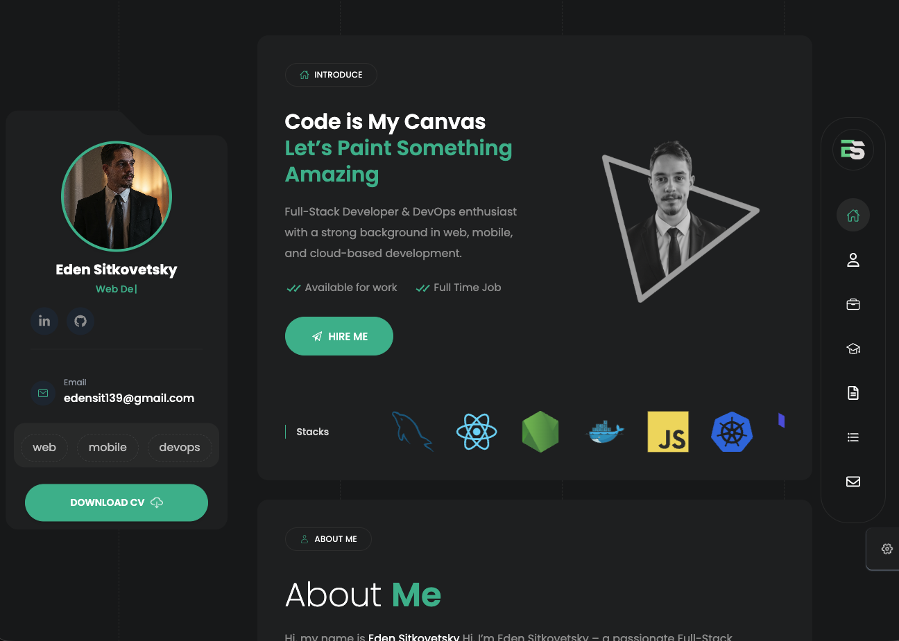
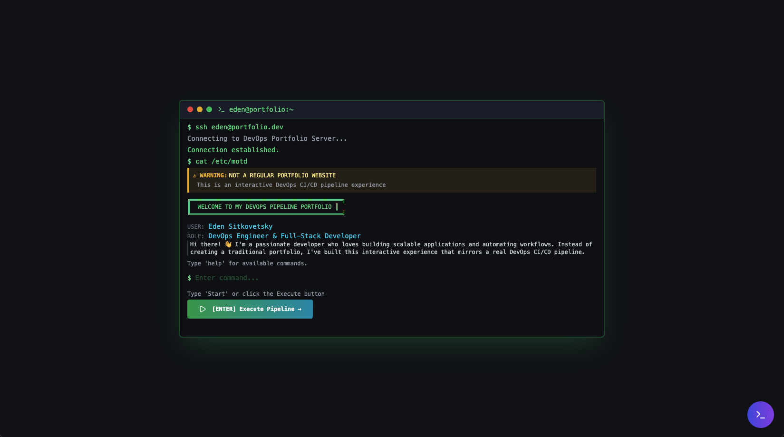
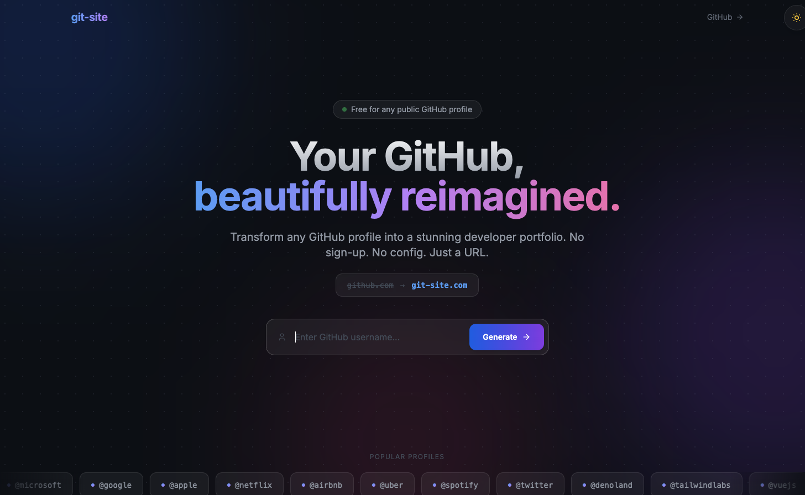
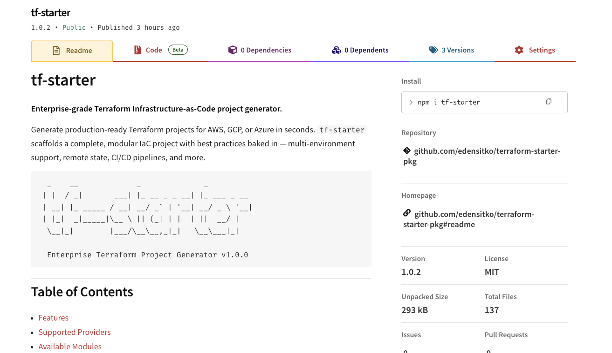

<!-- Added Header Wave animation -->

<!-- Added Profile Banner -->
<h1 align="center">
  

        
    
    
  

</h1>

<!-- <h1 style align="center">Hi there 👋, I'm <a href="https://www.linkedin.com/in/edensitko/">eden stikovetsky</a></h1> -->

<!--- Adding Header Elements -->

  

     
  
   
  

🚀 DevOps Engineer & Software developer | webapp • applications • automations • cloud ☁️

 

<!-- Added About Me Section and GIF -->

    
  <h2>👨🏻‍💻 About Me</h2> 
  builder , devops engineer , full stack developer , mobile developer  
  ⚡ <strong>Open-Source</strong> & <strong>Tech Enthusiast</strong> 
  📚 I am currently learning <strong> Kubernetes</strong> 
  🚀 Passionate about Engineering and Cloud Solutions  
  💡 Hobbies: coding </> , vibe coding 👨🏻‍💻 , time with family 👨‍👩‍👧‍👦 and football ⚽

 

<!--- Recent Activity Section -->

	
  
<b> portfolio's</b>

   

<table>
  <tr>
    <td width="50%" valign="top">
      <h3 align="center"> portfolio </h3>
      

        
        

            personal portfolio website 
            
           
          
        

        
<strong>Tech Stack:</strong> next.js, tailwind css , 

      

    </td>
    <td width="50%" valign="top">
      <h3 align="center"> devops portflio</h3>
      

        
        

            personal devops portfolio website
            
          
          
        

        
<strong>Tech Stack:</strong> next.js, tailwind css , javascript 

      

    </td>
   
  </tr>
</table>

 

 
<!--- Adding Tech Stack open Section -->

<h2><b>🛠 Tech Stack/ Certifications</b></h2>

<b>Languages:</b>     

<b>Frameworks and Libraries:</b>    

<b>Tools and Platforms:</b>     

<b>Cloud and infrastructure:</b>     

<!--- Recent Activity Section -->

	
  
<b>📚 Recent Projects</b>

   

<table>
  <tr>
    <td width="33%" valign="top">
      <h3 align="center">Github site generator </h3>
      

        
        

          just enter your GitHub username and get a personalized portfolio website showcasing your projects, contributions, and stats. Perfect for developers looking to create a professional online presence with ease.
            
           
          
        

        
<strong>Tech Stack:</strong> next.js, tailwind css , 

      

    </td>
    <td width="33%" valign="top">
      <h3 align="center">terraform starter package</h3>
      

        
        

            A Terraform starter package that provides a pre-configured setup for deploying and managing infrastructure on cloud platforms. It includes best practices, reusable modules, and templates to help developers quickly get started with infrastructure as code.
            
          
          
        

        
<strong>Tech Stack:</strong> Python, Terraform , jinja2 , NPM

      

    </td>
    
  </tr>
</table>

 

	
 
<b>🛠 Badges/Certifications</b>
 

  <table width="100%" align="center">
      <tr>
      </tr>
      <tr>
        <td>
          <strong> Achievement Badges</strong> 
        </td>
        <td>
          
<a href="https://gssoc.girlscript.tech/leaderboard?year=2024Extd&username=rajdeepchakraborty-rc">
            
            
            
          

        </td>
      </tr>

  </table>

 
 
 

<h2>📊GitHub Stats</h2>
<table width="100%" align="center">
<tr>
<td>
  
</td>
</tr>
</table>

<table width="100%" align="center">
<tr>
<td>
    
</td>
<td>

</td>
</tr>
</table>
 

 
<!--Added: Animated Line Seperators-->

<!--Added: Animated Line Seperators-->

<!-- Snake Contribution Animation -->

<!-- Added: New Heading for Snake Animation -->

  
  <h2 style="display: inline; margin: 0 10px;">
    My Contributions
  </h2>
  

<!-- Added Footer Wave animation -->

